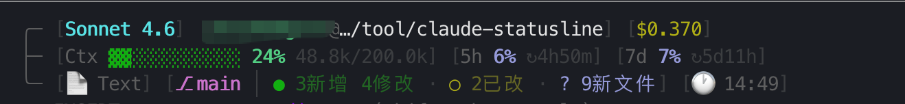

# claude/codex-statusline

为 **Claude Code** 和 **Codex CLI** 提供信息丰富的终端状态行，实时展示模型、上下文用量、速率限制、Git 状态与会话成本。

## 效果预览



---

## 目录结构

```
claude-statusline/
├── claude/                        # Claude Code 专用
│   ├── statusline.sh              # 状态行主脚本（由 Claude Code 调用）
│   └── setup.sh                  # 一键安装脚本
└── codex/                         # Codex CLI 专用
    ├── statusline.sh              # Codex 配置适配器（写入 config.toml）
    └── rate-limit-skill/          # Codex rate-limit 查询技能
        ├── SKILL.md               # 技能描述（Codex 读取）
        ├── README.md              # 技能使用说明
        └── scripts/
            └── codex_rate_limit.py  # rate-limit 查询脚本
```

---

## Claude Code 状态行

`claude/statusline.sh` 由 Claude Code 通过 `settings.json` 的 `statusLine.command` 字段调用，每次渲染时从 stdin 接收会话 JSON，输出三行状态。

### 功能特性

| 功能 | 说明 |
|------|------|
| 上下文可视化 | 进度条 `▓▓░░░░░░░░` + 百分比 + 已用/总量（自动 k/M 单位） |
| 速率限制监控 | 5 小时 & 7 天配额用量 + `↻` 重置倒计时 |
| 智能缓存 | 无 API 数据时回退缓存（6 小时有效期） |
| 语言识别 | 自动检测 Rust / Go / Python / TypeScript / Node.js / Java / PHP / Ruby / C++ 等 |
| Git 状态 | 分支名 + 领先/落后 `↑↓` + 暂存 `●` / 未暂存 `○` / 未跟踪 `?` / 冲突 `✖` |
| 成本追踪 | 会话累计成本（美元，三位小数精度） |
| 工作目录 | `user@dir` 格式，超长路径自动缩短至末两级 |
| 当前时间 | `HH:MM` 格式实时时刻 |

### 安装

**前提条件：** `bash`、`curl`、`jq`（安装脚本会尝试自动安装）、`git`（可选）、`python3`（推荐）

```bash
curl -sL https://raw.githubusercontent.com/will-yinchengxin/claude-statusline/refs/heads/main/claude/setup.sh | bash
```

安装过程会：
1. 检查并安装依赖（`jq`）
2. 下载 `statusline.sh` 至 `~/.claude/statusline.sh`
3. 将 `statusLine` 字段写入 `~/.claude/settings.json`，保留其他配置
4. 若已有其他状态行，询问是否替换

安装完成后**重启 Claude Code** 即可生效。

### 卸载

```bash
rm -f ~/.claude/statusline.sh
jq 'del(.statusLine)' ~/.claude/settings.json > ~/.claude/settings.tmp \
  && mv ~/.claude/settings.tmp ~/.claude/settings.json
```

### 自定义

直接编辑 `~/.claude/statusline.sh`，修改后无需重启，下次渲染时自动生效。

| 调整项 | 位置 |
|--------|------|
| 进度条宽度 | `BAR_WIDTH=12` |
| 颜色 | `RED`、`GREEN`、`CYAN` 等变量 |
| 隐藏成本 | 注释 `cost_part` 相关代码 |
| 隐藏 Git | 注释 `git_part` 相关代码 |
| 隐藏时间 | 注释 `time_part` 相关代码 |
| 目录截断长度 | `short_dir()` 中的 `30` |

---

## Codex CLI 状态行

Codex CLI 不支持外部 `statusLine` 命令，而是通过 `~/.codex/config.toml` 的 `[tui].status_line` 字段配置原生状态项。`codex/statusline.sh` 负责将这些原生配置项写入 config.toml，并提供本地预览。

### 安装 Codex 状态行

```bash
bash codex/statusline.sh --install
```

### 预览效果（不修改配置）

```bash
bash codex/statusline.sh --preview
```

### 查看配置项列表

```bash
bash codex/statusline.sh --items
```

---

## Codex Rate-Limit 技能

`codex/rate-limit-skill/` 是一个可安装到 Codex 的技能，让 Codex 能直接查询本地会话中记录的速率限制用量和恢复时间。

数据来源：`~/.codex/sessions/**/rollout-*.jsonl` 中的 `token_count.rate_limits` 快照，**无需联网**。

### 安装技能

```bash
mkdir -p ~/.codex/skills
cp -R codex/rate-limit-skill ~/.codex/skills/codex-rate-limit
chmod +x ~/.codex/skills/codex-rate-limit/scripts/codex_rate_limit.py
```

重启 Codex CLI 后，直接询问：

```
使用 codex-rate-limit skill，帮我查看当前用量和恢复时间
```

### 手动运行查询脚本

```bash
# 完整输出
python3 ~/.codex/skills/codex-rate-limit/scripts/codex_rate_limit.py

# 单行摘要
python3 ~/.codex/skills/codex-rate-limit/scripts/codex_rate_limit.py --short

# JSON 格式（机器可读）
python3 ~/.codex/skills/codex-rate-limit/scripts/codex_rate_limit.py --json

# 指定 sessions 目录
python3 ~/.codex/skills/codex-rate-limit/scripts/codex_rate_limit.py \
  --sessions-dir /path/to/.codex/sessions
```

---

## 许可证

MIT
